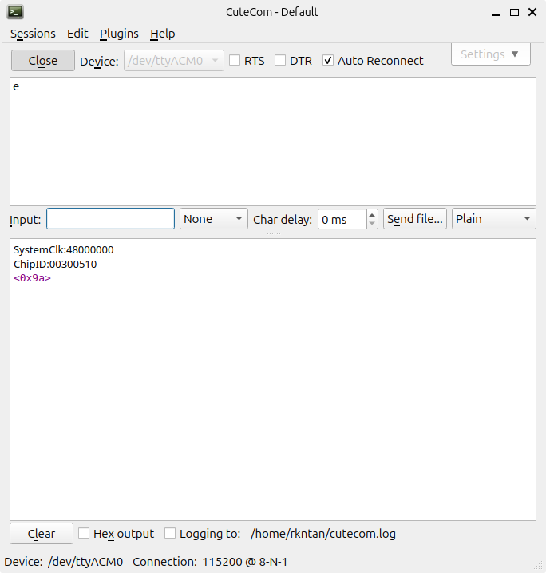

# ch32v003f4p-usart

simple usart1 demonstration. this project verifies serial transmission and basic data manipulation on the ch32v003.

## function
the program initializes usart1 at 115200 baud. it waits for an incoming byte, performs a bitwise NOT operation (`~val`), and transmits the result back.

## hardware connection

  WCH-LinkE                  CH32V003F4P6-EVT-R0
+-----------+              +-------------------+
|           |              |                   |
|       3V3 +--------------+ VCC               |
|           |              |                   |
|       GND +--------------+ GND               |
|           |              |                   |
| SWDIO/TMS +--------------+ PD1 (SWIO)        |
|           |              |                   |
|        TX +--------------+ PD6 (UART RX)     |
|           |              |                   |
|        RX +--------------+ PD5 (UART TX)     |
|           |              |                   |
+-----------+              +-------------------+

## serial configuration
* **baud rate**: 115200
* **data bits**: 8
* **stop bits**: 1
* **parity**: none

## verification
1. check terminal for `systemClk` and `chipid` to confirm the mcu is running.
2. send a character (e.g., 'e').
3. receive the inverted byte (e.g., `<0x9a>`).

## how to build
1. open mounriver studio.
2. import this folder.
3. build (hammer icon) and download (arrow icon).